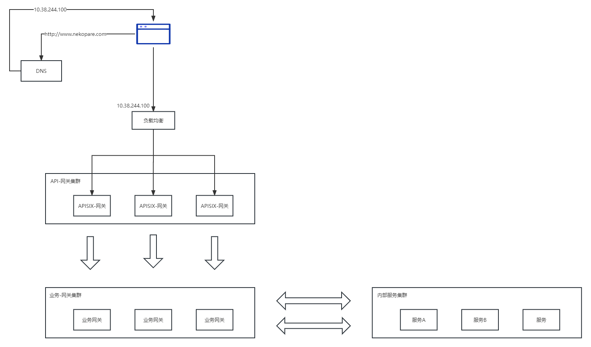

# APISIX
## Apache APISIX 是什么
云原生 API 网关，它兼具动态、实时、高性能等特点，提供了负载均衡、动态上游、灰度发布（金丝雀发布）、服务熔断、身份认证、可观测性等丰富的流量管理功能。我们可以使用 Apache APISIX 来处理传统的南北向流量，也可以处理服务间的东西向流量。

## 主要概念
### OpenResty
作为Web容器，nginx以最强的性能被广泛应用。不管公司使用什么语言进行业务开发，都能在网络架构的最前端看到nginx的身影。而为了利用nginx在性能上的优势，OpenResty通过集成luaJIT来让nginx有了执行lua脚本的能力。

### Upstream(上游)
上游的作用是按照配置规则对服务节点进行负载均衡，它的地址信息可以直接配置到路由或服务上。

### Route(路由)
通过路由定义规则来匹配客户端请求，根据匹配结果加载并执行相应的插件，最后把请求转发给到指定的上游应用。

## 