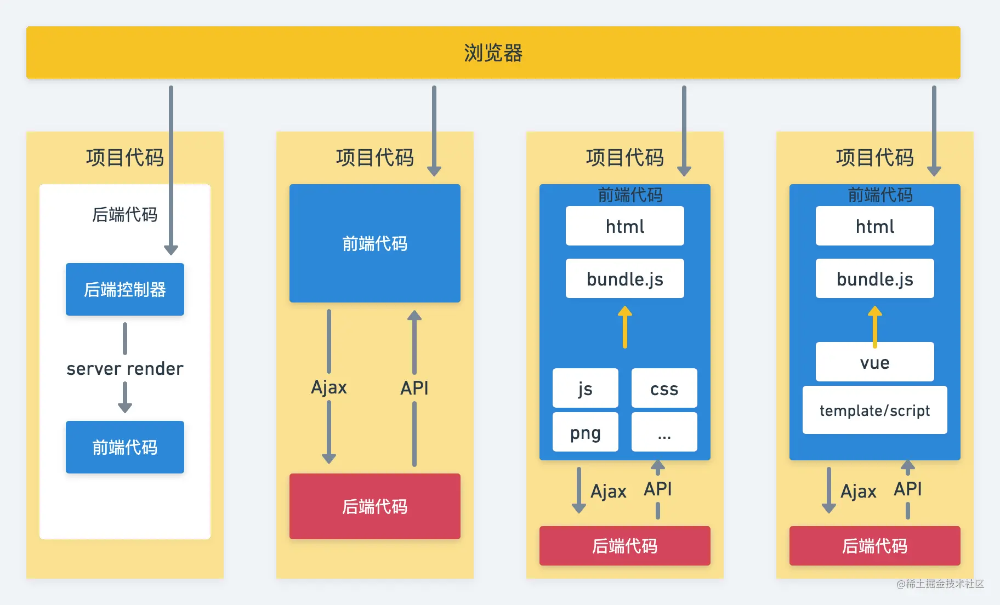

# 微前端
## 1. 前端发展阶段
首先我们来问一下自己：前端开发模式是如何一步一步发展到今天的？为什么现在我们前端开发需要安装 node、npm、webpack 等工具？如果不用这些技术，那如何做前端开发呢？

要回答上面的疑问，我们就把时间倒回到1990年，来看一下整个前端发展的几十年当中，有哪些标志性的事件。

- 1990年 世界上第一个网站在日内瓦的欧洲核子研究中心上线；
- 1995年 Brendan Eich 发明 Javascript，标志着前端开发的诞生；
- 2005年 Ajax(Asynchronous Javascript And XML) 概念提出，标志着前端开发模式进入到前后端分离的时代；
- 2006年 Jquery 首次发布；
- 2008年 V8引擎 首次发布，标志着 Javascript 有可能脱离浏览器进行使用；
- 2009年 nodejs 首次发布，标志着前端进入到一个飞跃的时代；
- 2010年 npm 首次发布，标志着模块化开发正式诞生；
- 2012年 webpack 首次发布，标志着现代前端开发模式正式形成；
- 2013年 Electron 首次发布，让JS能够跟C#、C++、QT等一种老牌的桌面开发语言竞争
- 2013年 React 首次发布，标志着前端开发模式正式进入到 MVVM 时代；
- 2014年 Vue 首次发布
- 2015年 ReactNative 首次发布
- 2016年 Angular 首次发布；

## 2. 微前端出现的背景
## 3. 微前端效果与原理
## 4. 微前端落地方案

## 参考资料
- [MDN-Web入门](https://developer.mozilla.org/zh-CN/docs/Learn/Getting_started_with_the_web)
- [MDN-Ajax](https://developer.mozilla.org/zh-CN/docs/Web/Guide/AJAX)
- [Wiki-Ajax](https://zh.wikipedia.org/wiki/AJAX)
- [Wiki-编程语言历史](https://zh.m.wikipedia.org/zh-sg/%E7%A8%8B%E5%BC%8F%E8%AA%9E%E8%A8%80%E6%AD%B7%E5%8F%B2)