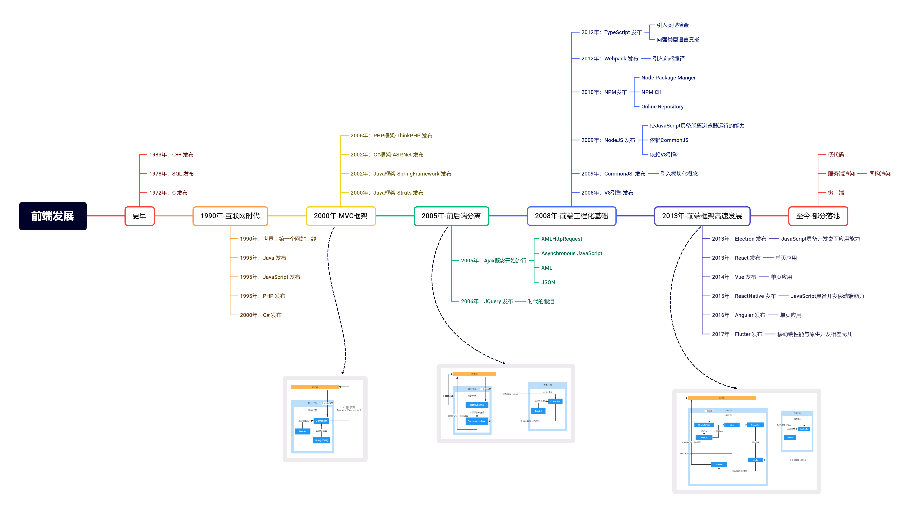
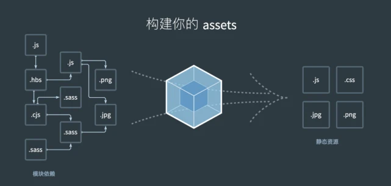
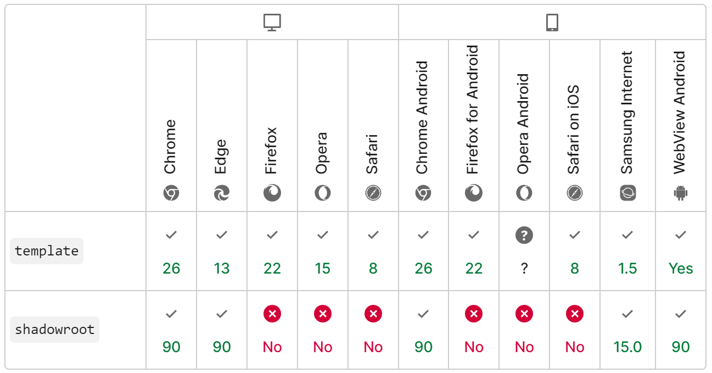

# 微前端

## 1. 前端发展阶段
前端开发模式是如何一步一步发展到今天的？为什么现在我们前端开发需要安装 node、npm、webpack 等工具？如果不用这些技术，那如何做前端开发呢？

### 1.1 前后端混合
这个阶段前端代码包含在后端代码中，浏览器不会请求前端资源，而是请求到后端的控制器中，然后通过服务端渲染的方式把页面资源返回给浏览器，Javascript 仅仅实现页面的交互逻辑。

### 1.2 前后端分离
这个阶段借助 ajax 技术实现了前后端分离，浏览器会直接请求前端资源，前端通过 ajax 向后台请求数据，后台通过api的形式给前端调用。从此前端脱离后端独立存在，这个时候开始出现前端工程师这一职业。

### 1.3 模块化开发
这个阶段借助于 npm 的模块化管理，可以上传和下载模块，从而实现了模块化开发方式。同时借助 webpack 的打包功能把 js, css, img等资源统一打包成一个 bundle.js 文件，浏览器加载的时候就加载一个或几个资源，极大了提升了网页性能。

### 1.4 SPA
React/Vue 等前端框架的出现，我们不会再去写 html, css 等代码了，而是写 vue 或者 jsx 的代码，最后利用 webpack 的 loader 工具把这些文件统一打包浏览器能识别的 js 文件。


## 2. 微前端出现的背景
我们一般把代码臃肿、难以维护的系统称作“巨石应用”。抽象、封装能够在一定程度上使代码友好一些，但效果总是有限的。此时就需要进行拆分。


后端微服务的开发模式，将代码拆分开，独立开发、运行、部署，运行时完全独立，通过远程调用交互。

但是前端浏览器有两个限制，导致难以模仿后端微服务的落地方案去进行拆分
- 只有一个运行时
- 入口是html文件

ThoughtWorks在2016年提出了微前端的概念，它借鉴了微服务的架构理念，核心在于将一个庞大的前端应用拆分成多个独立灵活的小型应用，每个应用都可以独立开发、独立运行、独立部署。  


### 2.1 前端路由
#### 2.1.1 后端路由
当在地址栏切换不同的ur时，都会向服务器发送一个请求，服务器响应这个请求，并在服务端拼接好html文件返回给页面来展示。
- 优点：利于SEO、无首屏空白问题、实现简单
- 缺点：依赖于网络，网速慢，用户体验很差，项目比较庞大时，服务器端压力较大，不能在地址栏输入指定的url访问相应的模块，前后端不分离

#### 2.1.2 前端路由
不同的url地址对应到不同的内容或页面这个任务是由前端来完成的，就是前端路由，前端路由是不会刷新页面的，随着SPA单页应用的普及，以及前后端分离，现在的项目基本上都是前端路由。
- 优点：前后端的彻底分离，不刷新页面，用户体验较好，页面持久性较好，比如音乐网站，当你播放了一个歌曲后，切换了页面，播放不会中断。这都是spa的好处
- 缺点：部署较为麻烦

前端路由实现方式：
- hash
- history

### 2.2 分包加载机制


#### 2.2.1 chunk
chunk 有两种形式：
- initial(初始化) 是入口起点的 main chunk。此 chunk 包含为入口起点指定的所有模块及其依赖项。
- non-initial 是可以延迟加载的块。可能会出现在使用 动态导入(dynamic imports) 或者 SplitChunksPlugin 时。
每个 chunk 都有对应的 asset(资源)。资源，是指输出文件（即打包结果）。

*webpack.config.js*
```javascript
module.exports = {
  entry: './src/index.jsx',
};
```

*./src/index.jsx*
```javascript
import React from 'react';
import ReactDOM from 'react-dom';

import('./app.jsx').then((App) => {
  ReactDOM.render(<App />, root);
});
```

这会创建出一个名为 main 的 initial chunk。其中包含：

- ./src/index.jsx
- react
- react-dom

以及除 ./app.jsx 外的所有依赖，然后会为 ./app.jsx 创建 non-initial chunk，这是因为 ./app.jsx 是动态导入的。

*Output:*
- /dist/main.js - 一个 initial chunk
- /dist/394.js - non-initial chunk

#### 2.2.2 Module-Federaltion
chunk加载本地模块，ModuleFederaltion加载远程模块

*webpack.config.js*
```javascript
module.exports = {
  plugins: [
    new ModuleFederationPlugin({
      name: 'host',
      remotes: {
        app1: 'app1@http://localhost:3001/remoteEntry.js',
      },
    }),
  ],
};
```

### 2.3 SystemJS
模块加载，但是应用在Client端。

引入模块
```vue
<script type="systemjs-importmap">
  {
    "imports": {
      "lodash": "https://cdn.bootcdn.net/ajax/libs/lodash.js/4.17.20/lodash.min.js" 
    }
  }
</script>
```

使用模块
```javascript
System.register(['lodash'], (exports) => {
   return {
     setters: [
       () => {};
     ],
     execute() {
       console.log('test');
       exports({_: lodash});
     })
   }
 }
})
```

### 2.4 IFrame
1997年出现的老大哥，浏览器默认实现的最强的隔离级别。每个嵌入IFrame的网页都有自己的会话历史记录 (session history)和DOM 树。  

通过IFrame可以做到在页面的任何位置，嵌入任何页面。

### 2.5 WebComponents
新出的HTML标准，浏览器兼容性不太好。  

Vue、React等语言因为是通过虚拟DOM去渲染真实DOM，因此可以很方便的做到代码复用。但是纯HTML标签无法进行扩展，因此HTML代码在组件化方面能力很差。WebComponents的出现就是为了解决这个问题。  

WebComponents由以下三项技术组成。
- Custom elements（自定义元素）：一组 JavaScript API，允许您定义 custom elements 及其行为，然后可以在您的用户界面中按照需要使用它们。
- Shadow DOM（影子 DOM）：一组 JavaScript API，用于将封装的“影子”DOM 树附加到元素（与主文档 DOM 分开呈现）并控制其关联的功能。通过这种方式，您可以保持元素的功能私有，这样它们就可以被脚本化和样式化，而不用担心与文档的其他部分发生冲突。
- HTML templates（HTML 模板）： ```<template/>``` 和 ```<slot/>``` 元素使您可以编写不在呈现页面中显示的标记模板。然后它们可以作为自定义元素结构的基础被多次重用。

 


## 3. 微前端方案
|方案|描述|优点|缺点|
|--|--|--|--|
|多页应用 | 通过Nginx配置反向代理来实现不同路径映射到不同应用 | 简单，快速，易配置 | 在切换应用时会触发浏览器刷新，影响体验|
|npm包形式 | 子工程以NPM包的形式发布源码；打包构建发布还是由基座工程管理，打包时集成。 | 实现方案简单，可以直接调用代码交互。 | 打包部署慢，不能单独部署|
|Module Federaltion|Webpack新出的加载远程包方案，解决的问题是项目解耦，而不是多系统聚合，只是恰好可以用来做微前端技术基础|解耦后子项目打包速度快|没有隔离能力，用它来实现微前端有不少要改造的|
|iframe嵌套 | 父应用单独是一个页面，每个子应用嵌套一个iframe | 实现简单，子应用之间自带沙箱，天然隔离，互不影响 | iframe的样式显示、兼容性等都具有局限性；需要自己解决，且iframe未来发展不明晰|
|WebComponents|HTML新出的前端组件化方案，有隔离能力，可以用来做沙箱|使用的是HTML标准，属于未来发展的方向|目前兼容性不太好|

## 4. 微前端框架
### 4.1 Single-SPA
出现最早的微前端框架，自己实现了一套JS加载方式、通信方式。没有隔离机制，CSS、JS会污染主应用。
### 4.2 Qiankun（阿里）
基于Single-SPA，提供了JS、CSS隔离机制，然后将入口从JS改为了HTML，接入更加方便。

### 4.3 Wujie（腾讯）
基于IFrame实现，JS放到同域IFrame隔离，样式通过ShadowDOM挂载到主应用。

### 4.4 MicroApp（京东）
基于WebComponents实现，符合HTML规范标准。

### 4.5 EMP（YY）
基于Webpack的Module-Federaltion实现方案，通过构建的方式进行微前端构建。


## 参考资料
- [MDN-WebComponents](https://developer.mozilla.org/zh-CN/docs/Web/Web_Components)
- [MDN-Web入门](https://developer.mozilla.org/zh-CN/docs/Learn/Getting_started_with_the_web)
- [MDN-Ajax](https://developer.mozilla.org/zh-CN/docs/Web/Guide/AJAX)
- [Wiki-Ajax](https://zh.wikipedia.org/wiki/AJAX)
- [Wiki-编程语言历史](https://zh.m.wikipedia.org/zh-sg/%E7%A8%8B%E5%BC%8F%E8%AA%9E%E8%A8%80%E6%AD%B7%E5%8F%B2)
- [MicroFront-WebComponents方案](https://micro-frontends.org/)
- [Webpack-Module-Federaltion](https://webpack.docschina.org/concepts/module-federation/)
- [Webpack-Chunk](https://webpack.docschina.org/concepts/under-the-hood/)
- [MicroApp](https://micro-zoe.github.io/micro-app/)
- [EMP](https://emp2.netlify.app/)
- [JavaScript-模块](https://juejin.cn/post/6844903632198959112#heading-1)
- [SystemJS](https://github.com/systemjs/systemjs)


TODO
方案对比文档：优缺点、技术栈、接入成本、维护成本、性能、社区活跃度、文档丰富度等


问题1：SharedLib Build速度
问题2：嵌入子应用的学习成本 - 微前端的学习成本、接入成本
问题3：前端样式不统一，考虑微前端是否有统一解决方案，例如组件封装，所有应用复用
- 禁止前端切换主题
